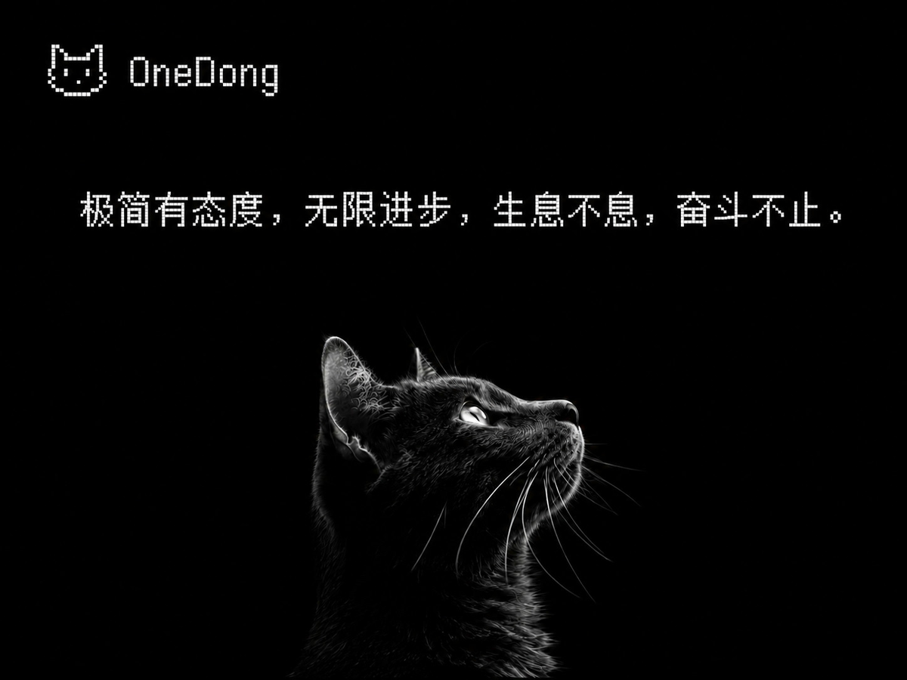

# OneDong

> 一款受 [Fuwari](https://github.com/saicaca/fuwari)(基于 Astro 的博客模板)启发的 WordPress **经典博客主题**。柔和的卡片式布局、OKLCH 调色板、虚线下划线链接、浅色「Slate Paper」代码块,内置浅色 / 暗色双模式。



## ✨ 特性

- 🎨 **Fuwari 设计语言**:OKLCH 调色板(默认蓝紫色相 250)、卡片式文章、虚线链接、统一圆角体系
- 🌗 **浅色 + 暗色双模式**:自动跟随系统 + 手动切换 + 本地记忆,**无闪烁**(anti-flash)
- 💻 **代码块**复刻 "Slate Paper" + 顶部三圆点,集成 **Prism.js** 语法高亮
- 📱 **响应式**:文章卡片网格,移动端自适应
- 🧩 **古腾堡友好**:`theme.json` 配色 / 字体对齐,兼容各类块(block)
- ⚙️ **主色可调**:后台 `自定义` 里用滑块调色相(0–360)
- 🔍 **完整博客**:首页 / 单篇 / 独立页 / 归档 / 分类 / 标签 / 搜索 / 404 / 上下篇导航

## 📦 安装

### 方式一:上传 zip
1. 将 `onedong/` 文件夹压缩为 `onedong.zip`
2. 后台 → `外观` → `主题` → `安装新主题` → `上传主题` → 选 zip → `现在安装`
3. 启用 `OneDong`

### 方式二:手动
1. 将整个 `onedong/` 文件夹复制到 `wp-content/themes/`
2. 后台 → `外观` → `主题` → 启用 `OneDong`

## ⚙️ 自定义

| 项目 | 路径 |
| --- | --- |
| 主色色相 | `外观` → `自定义` → `OneDong 主题` → `主色色相`(200 青绿 / 250 蓝紫 / 310 紫粉 / 345 粉红) |
| 导航菜单 | `外观` → `菜单`,设置 **顶部导航** 与 **页脚导航** |
| Logo | `外观` → `自定义` → `站点身份` → `Logo` |
| 代码高亮 | 默认走 jsDelivr CDN 加载 Prism.js;如需离线,把 `functions.php` 中三处 Prism 的 CDN URL 换成本地 `assets/js/vendor/` 路径 |

## 🗂 文件结构

```
onedong/
├── style.css              # 主题头注释(WordPress 识别入口)
├── theme.json             # 古腾堡编辑器配色 / 字体对齐
├── functions.php          # 主题支持 / 菜单 / enqueue / Customizer / 代码块语言补全
├── header.php footer.php index.php home.php
├── single.php page.php archive.php search.php 404.php
├── template-parts/        # content(列表卡片) / content-none(空状态) / pagination
├── assets/css/            # tokens / base / code / layout 四份样式
├── assets/js/             # theme-toggle(暗色切换)
├── screenshot.png         # 主题封面(1200×900)
└── DEV_NOTES.md           # 开发笔记(决策 / 坑)
```

## 🔤 字体

开箱即用系统字体。安装以下字体获得最佳体验:

| 用途 | 字体 | 链接 |
| --- | --- | --- |
| 正文 | Roboto / Inter | <https://fonts.google.com/specimen/Roboto> · <https://rsms.me/inter/> |
| 代码 | Maple Mono / JetBrains Mono | <https://github.com/subframe7536/maple-font> · <https://www.jetbrains.com/lp/mono/> |

## ✅ 兼容性

- WordPress **6.4+**
- PHP **7.4+**
- 使用 `oklch()`、`color-mix()`、`:has()`、`clamp()` 等现代 CSS,需较新版浏览器(Chrome / Edge / Firefox / Safari 近年版本均可)

## 🙏 致谢

- [Fuwari](https://github.com/saicaca/fuwari) —— 原始视觉设计
- [Prism.js](https://prismjs.com/) —— 语法高亮
- 视觉语言移植自本仓库的 Fuwari Typora 主题(`fuwari-light.css`)

## 📄 License

MIT
